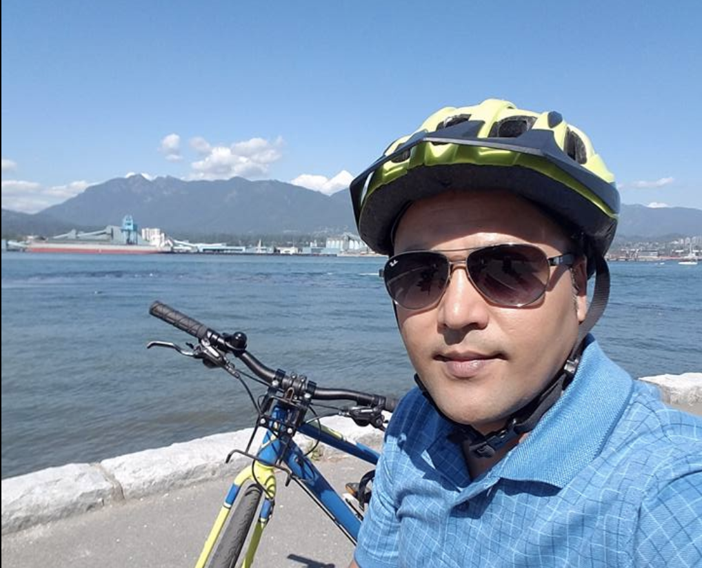

**Find me at:** 
| [Linkedin](https://www.linkedin.com/in/santosh-kc-phd-00a0b38/)| [Github](https://github.com/kcantosh) |[Twitter](https://twitter.com/dearsanto) 

 
 
  
     Santosh KC, Ph.D.  

 I am a physicist and a material scientist by profession. I have been working on materials modeling for more than 5 years. I am interested in understanding structure-property relationship based on computational methods including Density Functional Theory and beyond. I have been investigating electronic, optical, and magnetic properties of materials for various technological applications including energy storage, electronic, optical, and functional devices..
 
I am interested in designing the materials with novel properties for various applications based on Density Functional Theory (DFT). Moreover, I go beyond standard DFT to include thermodynamics as well as relevant excited state properties. I provide synthesis routes to the experimental group. In addition, simulating device properties will be every useful for device community. I perform theoretical electronics structures calculations (ARPES), microscopy (STM imaging) and theoretical vibrational spectroscopy (Raman, IR, neutron experiments) in order to get better correlations between the structure and property. This will also greatly help to understand and explain the experimental findings. I have research experiences in the following areas:
Complex Oxides, Layered Materials, Multiferroics, Energy storage. (2015-Present).
2D materials and their interfaces with dielectrics for semiconductor device applications. (2012-2015).
Solid electrolytes, electrode-electrolyte interface for all solid state Li-ion battery application. (2010-2014).
Ab-initio calculations of ground state properties of molecules. (2006-2007).

**Find my previous research:** | (https://santoshkcscience.blogspot.com/p/research.html)|

**Teaching:** |(https://santoshkcscience.blogspot.com/p/teaching.html)| 

 

***Research Topic 1.*** [***Semiconductor Devices***]

--------------------------------------

***Research Topic 2.*** [***Energy Storage***](): 

--------------------------------------

